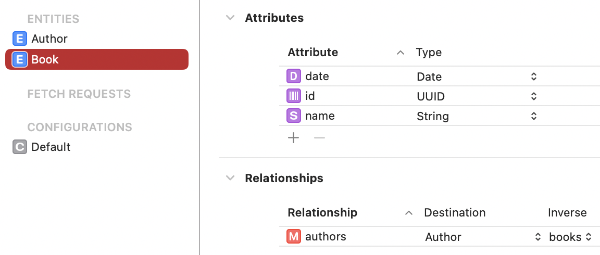
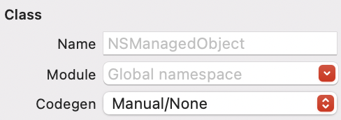

# Basic usage

### 1) Create data model and describe entities as usual



### 2) Disable built-in codegen



### 3) Use your domain models

``` swift
struct Author {
    var id: UUID?
    var name: String = ""
}
```

``` swift
struct Book {
    var id: UUID?
    var name: String = ""
    var date: Date?
}
```

### 4) Conform them to ManagedObjectConvertible protocol

``` swift
extension Author: ManagedObjectConvertible {
    static let entityName = "Author"

    static let attributes: Set<Attribute<Author>> = [
        .init(\.id, "id"),
        .init(\.name, "name"),
    ]

    struct Relations {
        let books = ToManyRelation<Book>("books")
    }

    static let relations = Relations()
}
```

``` swift
extension Book: ManagedObjectConvertible {
    static let entityName = "Book"

    static let attributes: Set<Attribute<Book>> = [
        .init(\.id, "id"),
        .init(\.name, "name"),
        .init(\.date, "date"),
    ]

    struct Relations {
        let authors = ToManyRelation<Author>("authors")
    }

    static let relations = Relations()
}
```

### 5) Setup data layer

``` swift
final class DataLayer {
    private let db: PersistentContainer

    init() {
        let pc = NSPersistentContainer(name: "DataModel")
        pc.loadPersistentStores(completionHandler: { _, _ in })
        self.db = .init(managedObjectContext: pc.newBackgroundContext)
    }

    func allBooks() throws -> [Book] {
        try self.db.perform { ctx in
            try ctx.fetch(Book.all).map { try $0.decode() }
        }
    }

    func insert(book: Book) throws {
        try self.db.perform { ctx in
            ctx.insert(book)
        }
    }
}
```

### 6) Voila

``` swift
let layer = DataLayer()
let book = Book(id: .init(), name: "best book", date: Date())
try layer.insert(book: book)
let books = try layer.allBooks()
```
