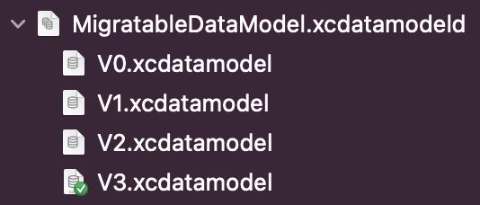

# Progressive migrations

CoreData has a built-in model-driven data migration engine. But from a product development perspective, these migrations have one major drawback. Since migration is always performed from any version of the storage to the selected (latest), then with each next release of your product, the QA team must check all combinations of migrations. To avoid these difficulties, there is the idea of progressive migrations, when instead of one migration M -> N, you need to carry out N-M migrations: M, M + 1, ..., N-1, N. This approach allows for per-release testing of migrations, i.e. check only N-1 -> N migration. The general algorithm for progressive migrations when working with CoreData is very simple: we find the version of the model that matches the metadata of the existing storage and, step by step, we migrate to the latest available model version. If the storage is not found, then we simply create a new one with the metadata of the latest model version. Of course, in case of updating from very old versions of a product to a fresh one, a situation is possible when there are a lot of migration steps, but this is a tradeoff in order to ensure fast and reliable product releases.

## Sworm way

1) Create model version using Xcode in the usual way:



2) Create an instance of SQLiteStoreDescription:

``` swift
let storeDescription = SQLiteStoreDescription(
    name: "MigratableStore", // just name
    url: <store url>, // file url, where sqlite database is placed
    modelName: "MigratableDataModel", // name of your xcdatamodel
    modelVersions: [
        "V0", // model version without mapping model
        .init(name: "V1", mappingModelName: "V0V1"), // model version with mapping model
        .init(name: "V2", mappingModelName: "V1V2"),
        "V3",
    ]
)
```

3) Initialize the migration object:

``` swift
let migration = try SQLiteProgressiveMigration(
    store: storeDescription,
    bundle: bundle // where to search compiled model versions and mapping models
)
```

4) Perform migration:

``` swift
if let migration = migration {
    print(migration.stepCount)

    try migration.performMigration(progress: <progress closure>)
}
```

## Example

How to use progressive migrations with NSPersistentContainer:

``` swift
let persistentContainer = try NSPersistentContainer(store: storeDescription, bundle: bundle)
let migration = try SQLiteProgressiveMigration(store: store, bundle: bundle)
try migration?.performMigration(progress: nil)
try persistentContainer.loadPersistentStore()
```

## Links

[williamboles.me](https://williamboles.me/progressive-core-data-migration/)

[objc.io](https://www.objc.io/issues/4-core-data/core-data-migration/#progressive-migrations)

[kean.blog](https://kean.blog/post/core-data-progressive-migrations)
